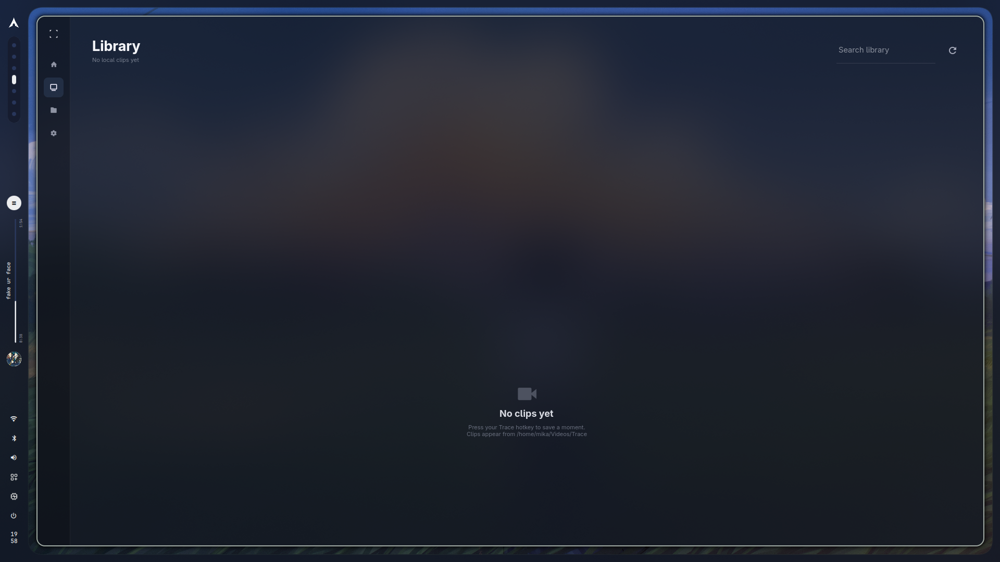

# Trace

> [!CAUTION]
> **Trace is still a test version.** It is usable, but it is not finished yet.
> Recording and the library work well on the tested setup, while wider hardware
> support and edge cases still need more testing.



Trace is an instant replay recorder for Arch Linux and Hyprland. It keeps the
last few seconds encoded in memory and saves them when you press your hotkey.
Nothing is uploaded, and the replay buffer does not touch the disk until a clip
is saved.

The current version has:

- AMD and NVIDIA hardware encoding through `gpu-screen-recorder`;
- a native Hyprland hotkey with no keyboard polling;
- desktop audio and a selectable PipeWire microphone;
- configurable clip length, frame rate, codec, quality, and microphone level;
- a GTK4 clip library with playback, search, rename, delete, and collections;
- colors taken from the current wallpaper or an existing Quickshell/Pywal
  palette;
- local FFmpeg thumbnails;
- no account, telemetry, cloud sync, or network client.

## Performance

Saving feels immediate because the replay is already encoded. The hotkey only
sends a small command over a local Unix socket; it does not start a new
recording or wait for the clip to be rendered.

These measurements were taken on a Ryzen 7 7800X3D and an AMD Navi 32 GPU while
recording 1080p at 60 FPS with a 30-second H.264 buffer, desktop audio, and a
microphone:

| Resource | Recorder | Idle library |
| --- | ---: | ---: |
| CPU | 5.7% of one thread (0.36% of the full CPU) | 0.13% of one thread |
| Memory | 279 MiB | 161.5 MiB while open |
| AMD encoder | 9.2% | — |
| AMD graphics | 0.8% | — |
| GPU memory | 50.7 MiB VRAM + 25.2 MiB GTT | — |
| Disk I/O while buffering | 0 B read / 0 B written | — |

The sample used Trace `0.1.0.r27.g67cec71`. CPU and memory were measured from
the complete `traced.service` cgroup for 30 seconds. GPU figures came from the
recorder's DRM `fdinfo` counters. Disk I/O was sampled for 15 seconds with a
full replay buffer. Results will vary with the GPU, driver, resolution, codec,
and enabled audio sources.

The installed package is 2.57 MiB. `trace-ui` is a separate process and closes
when the window closes, so its memory is not part of normal background use.

## Components

- `traced` keeps the encoded replay buffer in the background.
- `tracectl` talks to the daemon and is used by the Hyprland bind.
- `trace-ui` provides the library, player, collections, and settings.

## Requirements

Trace currently targets Arch Linux with Hyprland. The recorder and playback
dependencies are available from the official repositories:

```bash
sudo pacman -S gpu-screen-recorder gst-plugins-base gst-plugins-good gst-libav libpulse
```

## Build

```bash
cargo build --workspace
cargo test --workspace
```

Run the interface during development with:

```bash
cargo run -p trace-ui
```

Useful CLI commands:

```bash
tracectl monitors
tracectl config monitor DP-1
tracectl config hotkey SUPER+SHIFT+R
tracectl config duration 30
tracectl config fps 60
tracectl bind
tracectl doctor
```

Enable the recorder at login with:

```bash
systemctl --user enable --now traced.service
```

## Local data

Configuration is stored below `$XDG_CONFIG_HOME/trace`. Clips default to
`$HOME/Videos/Trace`, and runtime control uses a Unix socket below
`$XDG_RUNTIME_DIR`.

See [docs/architecture.md](docs/architecture.md) for the process layout and
privacy boundaries.

## License

MIT
